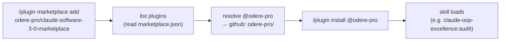

# Software 3.0 — the marketplace as an agent-operable registry

## The framing

Andrej Karpathy's three eras:

- **Software 1.0** — code you write. Explicit instructions a CPU executes.
- **Software 2.0** — weights you train. The program is a dataset; gradient descent writes the logic.
- **Software 3.0** — LLMs as the runtime, **natural-language prompts as the program**. The interesting
  design surface moves outward, to the **interfaces an LLM can drive**: stable input contracts,
  machine-readable descriptions, and docs the model can consult mid-task.

A registry is the least glamorous corner of a toolchain — a list of where things live. That makes it
the sharpest test of the thesis. This one is Software 3.0 not because an LLM helped write it, but
because **an agent can operate it end to end with no human in the loop**.

## The thesis

> The marketplace is Software 3.0 because an agent can **discover, vet, and install** any `odere-pro`
> plugin using only natural language, the user's terminal, and what this repo ships — and can **extend
> the registry** (add a plugin) under the same contract. The product is *agent-operable*, not "contains
> an AI".

If an agent needs a human to read a wiki, guess a coordinate, or hand-edit JSON by feel, the registry
has failed the test. Every choice below removes one such human.

## The package-registry analogue

The shape is a package manager, mapped onto agent-operability:

| Package-manager concept | This registry | Why it's agent-operable |
| ----------------------- | ------------- | ----------------------- |
| The registry index | `.claude-plugin/marketplace.json` | one machine-readable file, one schema |
| A package | a plugin in its **own** `odere-pro` repo | versioned at the source, not here |
| The install coordinate | `<plugin>@odere-pro` | a stable name an agent can compute |
| `npm publish` review | `tests/gates/*` + CI | integrity is enforced, not trusted |
| Install-time scripts' sandbox | `.claude/hooks/*` | guardrails on every edit to the index |
| The man page | nested `CLAUDE.md` + this doc | the agent reads the layer it's working in |

## The lifecycle (what the agent actually does)

No step needs a human: the coordinate is derivable from the entry `name`, the index is JSON, and the
failure modes are gated, not folklore. The `/add-plugin` skill drives the reverse direction — extend the
index — under the same contract.

## The pillars

**1 · One machine-readable contract at the boundary.** The entire product surface is
`.claude-plugin/marketplace.json`: top-level `name: "odere-pro"`, and a `plugins[]` array where each
entry is an `odere-pro` `github` source carrying `description`, `homepage`, `license`, `keywords`. An
agent reads it without parsing prose. The schema is pinned via `$schema`.

**2 · A stable, computable install coordinate.** Installs are always `<plugin>@odere-pro`, regardless of
this repo's name. The marketplace `name` — not the repo — is the coordinate, so an agent can construct
the exact install command from the entry name alone.

**3 · No version, no pin — the source owns truth.** Entries omit `version` (each plugin's own
`plugin.json` is the version of record) and omit `sha`/`commit` (installs track the default branch).
There is one place a version can drift from, and it isn't here.

**4 · The name is load-bearing, and singular.** Claude Code keys marketplaces by name. Two repos
declaring `odere-pro` means one silently shadows the other. So this registry is the *only* repo allowed
to declare that name; listed plugins ship no `marketplace.json` of their own. Gate `02` pins the name;
the design makes the collision impossible.

**5 · Docs the agent can consult mid-task.** Every layer carries a `CLAUDE.md` that says just enough for
its level, detail deepening as you descend (`.claude-plugin/` is the deepest). If an agent needs
something the docs don't say, that's a bug — the product is the docs plus the manifest.

## The gates that hold the contract

`tests/gates/run-all.sh` (run in CI by `.github/workflows/ci.yml`) is what makes "trust" mechanical:

| Gate | Property it guarantees |
| ---- | ---------------------- |
| `01-json-parses` | the index is machine-readable at all |
| `02-marketplace-shape` | the contract above (name, `odere-pro` `github` sources, unique entry names, no `version`/`sha`) |
| `09-readme-in-sync` | the README plugins table is generated from the manifest — docs can't drift |
| `03-no-absolute-paths` / `04-secret-scan` | nothing leaks a machine path or a credential |
| `05-doc-links` | the man pages don't dangle |
| `06-shellcheck` | the harness hooks are sound |
| `07-claude-md-coverage` | every layer an agent lands on has a briefing |

Interactively, `.claude/hooks/marketplace-guard.sh` enforces the same `02` invariants *before* a bad
edit lands — local feedback that mirrors CI.

## A worked example

> "Add my new plugin `claude-wiki-pages` to the marketplace."

An agent runs `/add-plugin claude-wiki-pages`. The `plugin-onboarder` agent vets the repo via
`vet-candidate.sh` (owner `odere-pro`, valid `plugin.json`, ships no `marketplace.json` of its own, not
already listed) and curates the description/keywords. If a blocker is found — e.g. the candidate still
ships its own `marketplace.json` — it **stops with the fix** and writes nothing. Otherwise
`add-entry.sh` inserts the entry (`jq`, no `version`), `sync-readme.sh` regenerates the README table, a
`CHANGELOG.md` bullet is added, `bash tests/gates/run-all.sh` goes green, and it opens a PR; `ci.yml`
re-runs the gates. After merge, anyone runs `/plugin install claude-wiki-pages@odere-pro`. No human
guessed a coordinate or eyeballed JSON.

## Where to read next

- Adding a plugin (the agent-driven workflow) — [`docs/adding-plugins.md`](docs/adding-plugins.md)
- The manifest contract, in depth — [`.claude-plugin/CLAUDE.md`](.claude-plugin/CLAUDE.md)
- The gate suite — [`tests/gates/CLAUDE.md`](tests/gates/CLAUDE.md)
- CI and supply chain — [`.github/CLAUDE.md`](.github/CLAUDE.md)
- The dev harness — [`.claude/CLAUDE.md`](.claude/CLAUDE.md)
- Adding a plugin — [`CONTRIBUTING.md`](CONTRIBUTING.md)
